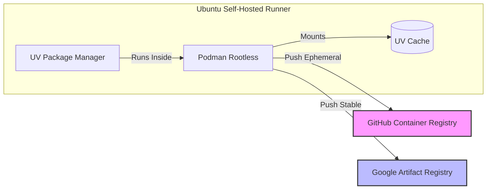
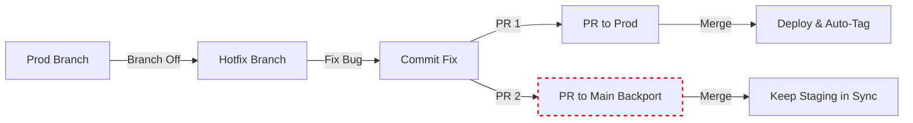
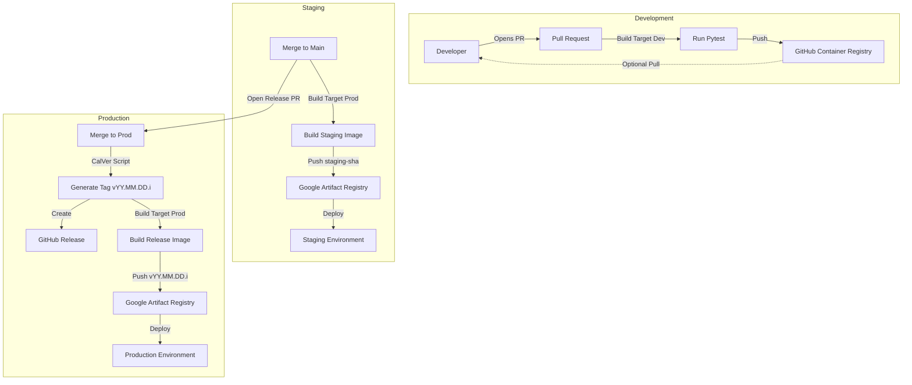

# **Deployment Architecture: Podman, UV, and Split Registries**

This document outlines the architectural decisions for our CI/CD pipeline, focusing on security, performance, and cost optimization.

## **1\. The Core Stack**

* **Package Manager:** uv (Astral)  
* **Container Engine:** Podman (Rootless)  
* **Orchestration:** GitHub Actions (Self-Hosted on Ubuntu)  
* **Registry Strategy:** Split (GHCR for Dev / Google Artifact Registry for Prod)

## **2\. Key Architectural Decisions**

### **A. The "Split Registry" Strategy**

We purposefully push images to two different locations based on their lifecycle stage.

| Registry | Use Case | Retention Policy | Reason |
| :---- | :---- | :---- | :---- |
| **GitHub Container Registry (GHCR)** | **Pull Requests** | Short / Ephemeral | Keeps "garbage" images out of our production registry. Free/included storage for active development artifacts. Accessible easily by devs for debugging. |
| **Google Artifact Registry (GAR)** | **Staging & Prod** | Long Term / Immutable | Only verified, merged code enters the "Trusted Zone" in GCP. This reduces storage costs and simplifies audit logs (only "real" releases exist here). |

### **B. Why Podman on Self-Hosted Runners?**

Running containers on our own infrastructure (Self-Hosted) gives us speed, but running standard Docker introduces a security risk: the Docker Daemon runs as root.

* **Security:** We use Podman in **Rootless Mode**. If a malicious script escapes the container during a test run, it only gains the permissions of the github-runner user, not root access to the host server.  
* **Compatibility:** Podman supports the Dockerfile syntax natively, so no code changes are required.

### **C. The uv Cache Strategy**

Python builds are notoriously slow due to dependency resolution. We mitigate this using uv's advanced caching features.

1. **Multi-Stage Build:** We define a base stage with shared configurations.  
2. **Targeted Builds:**  
   * **Target dev:** Includes uv sync \--dev. Used for running Pytest in CI.  
   * **Target prod:** Includes uv sync \--no-dev. Results in a significantly smaller image (approx. 40% smaller) by stripping test frameworks.  
3. **Cache Mounting:** We use \--mount=type=cache,target=/root/.cache/uv. This allows Podman to cache the downloaded wheels on the Host machine. A repeated build of unchanged dependencies takes **milliseconds**.

## **3\. Release & Branching Strategy**

We follow an Environment-Branching model with strictly defined paths for Releases and Hotfixes.

### **A. The Tagging Strategy (CalVer)**

Instead of semantic versioning (v1.2.0), we use Calendar Versioning with an incremental counter: vYY.MM.DD.i.

* **Reasoning:** It provides immediate context on *when* a deploy happened.  
* **Implementation:** We use a custom Bash script in the pipeline to fetch the day's tags and increment the counter. This removes dependency on 3rd-party Actions.

### **B. The Hotfix Workflow**

Hotfixes are treated as "Direct-to-Prod" exceptions that must also be backported.

1. Create a branch hotfix/my-fix from prod.  
2. Open **Pull Request** to prod.  
3. **Important:** Also open a backport Pull Request to main to ensure the next staging release doesn't regress the fix.

## **4\. The Flow Diagram**

The following diagram illustrates the lifecycle of code from development to production.

1. **Feature Development (PR -> GHCR):**  
   * Developer opens PR against main.  
   * Pipeline runs tests in target: dev container.  
   * Artifact pushed to **GHCR** (tagged pr-123) for optional manual QA.  
2. **Staging Deployment (Merge to main):**  
   * Code is merged into main.  
   * Pipeline builds target: prod.  
   * Pushed to **GAR** (tagged staging-sha123).  
   * *Outcome:* Staging environment auto-updates.  
3. **Production Promotion (Merge main -> prod):**  
   * A "Release PR" is opened merging main into prod.  
   * On merge, the pipeline:  
     1. Generates Tag v26.02.03.1 (via script).  
     2. Creates GitHub Release.  
     3. Builds & Pushes v26.02.03.1 to **GAR**.  
4. **Hotfix Deployment (Merge hotfix -> prod):**  
   * Works exactly like Production Promotion.  
   * The merged hotfix immediately triggers the Tag/Release/Deploy pipeline on prod.

## **5\. Maintenance Notes**

* **Pruning:** The self-hosted runner automatically cleans up images older than 24h to prevent disk overflow.  
* **Secrets:** Requires GCP\_SA\_KEY (JSON format) and GITHUB\_TOKEN (Automatic) to function.
